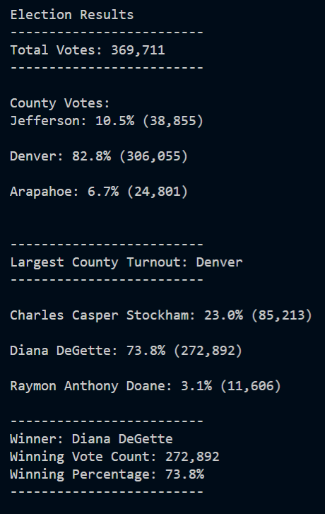

# Election-Analysis
## An audit and analysis of Colorado electoral data utilzing Python.
____________________________________________________________________

**Analysis Overview**

A Colorado Board of Elections employee requires the following tasks to be completed to execute an election audit of a recent congressional election:  

* Calculate the total number of votes cast. 
* Obtain a complete list of candidates who received votes.
* Calculate the total number of votes each candidate received. 
* Calculate the percentage of cotes each candidate won. 
* Determine the winner of the election based on popular vote. 
* The voter turnout for each county
* The percentage of votes from each county out of the total count
* The county with the highest turnout

Using Python and Visual Studio Code, a script was written to analyze the dataset provided by the client and produce an analysis of the election audit. 

**Resources**

* Data Source: election_results.csv
* Python 3.10.5, Visual Studio Code, 1.68.1

**Analysis Summary**

The final analysis of the election produced the following results:

* There were a total number of 369,711 votes recorded during this election. 

* The county with the highest voter turnout was Denver County,  producing 82.8% of the ballot and totalling 306,055 votes.
* Jefferson county came in second place, making up 10.5% of the ballot and totalling 38,855 votes.
* Arapahoe county came in last place, making up only 6.7% of the ballot and totalling 24,801 votes.

The candidates of the election are as follows:
* Raymon Anthony Doane, only receiving 3.1% of the ballot and toalling 11,606 votes.
* Charles Casper Stockham, coming in second place, receiving 23.0% of the ballot and totalling 85,213 votes.
* Diana DeGette, the winner of this election, receiving 73.8% of the ballot and totalling 272,892 votes.

Below is a screenshot of the text document produced when the election audit script in the PyPoll_Challenge.py code is ran. All data listed above is visible in an easy to read, easy to understand list for the viewer. 

**Final Summary**

The dataset this audit utilizes is stored within a CSV file listing the Ballot ID, County and Candidate Voted For in columns (The election_results.csv file located within the Resources folder). The Python script written reads and analyzes this dataset, outputting the desired information into a text file for optimal viewing. The script defines the candidate names as a list, creates a dictionary where the candidates’ names are stored as keys, and reports the number of votes as values. This same coding is used to report the county voter turnout data as well.  

When the election audit was expanded to include the voter turnout by county, the viewer was given a better understanding of the poll to conduct further analysis with. This data could be useful in many ways to help forecast, study demographics, as well as plan future campaigns and elections. 

Updating the script to include county data was a minor adjustment that helped produce more meaningful results within the analysis. Additional updates could be made to this code that further analyze the county turnout data using the provided dataset. For instance, an additional if-statement could be used to analyze the candidate votes by county to determine the percentage share each candidate had in each of the recorded counties. This would allow us to view the winning candidate conclusions by county.  

This script could be expanded to include as many results as the data given provided it with to analyze. Using for loops and nested for loops, county turnout, city turnout, voting party, or any other further demographical statistics could be calculated if the dataset provided this additional information. Furthermore, the script could also be edited to be used on a state level or expanded to include as many candidates and counties as necessary for a larger analysis.  
